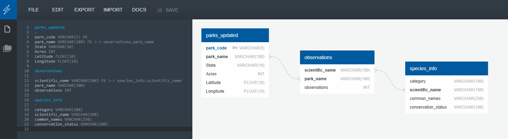

# National Parks Biodiversity Database

---

## Table of Contents
- [Project Overview](#project-overview)
- [ETL Workflow](#etl-workflow)
- [Database Design](#database-design)
- [Data Sources](#data-sources)
- [Technologies Used](#technologies-used)
- [How to Use This Project](#how-to-use-this-project)
- [Ethical Considerations](#ethical-considerations)
- [Team Members](#team-members)
- [References](#references)

---

## Project Overview

The **National Parks Biodiversity Database** project investigates the diversity of species observed across U.S. National Parks. The database also includes relevant geographical and environmental data such as park location and acreage. By centralizing this information into a structured SQL database, we enable efficient querying and exploration of trends related to conservation efforts, species habitats, and biodiversity richness.

This project was completed for a Data Analytics Bootcamp as a collaborative team effort.

---

## ETL Workflow

Our workflow includes:
1. **Extracting** three primary CSV datasets from [Kaggle.com](https://www.kaggle.com/):  
   - `parks.csv` (Park metadata)  
   - `observations.csv` (Species observations)  
   - `species_info.csv` (Species classification and conservation info)

2. **Transforming** the data by:
   - Replacing long park names (e.g., "Bryce Canyon National Park" → "Bryce National Park")
   - Renaming inconsistent columns (e.g., `Park Name` → `park_name`, `Park Code` → `park_code`)
   - Saving cleaned parks data as `parks_updated.csv`
   - Using SQL LEFT JOINs to merge observations, park metadata, and species info into a single final dataset

3. **Loading** the cleaned and joined data into a **PostgreSQL** database (`national_park_species_db`) using `psycopg2`. Data is pulled and merged using direct SQL queries within a Jupyter Notebook.

---

## Database Design

We selected **PostgreSQL** for robust querying capabilities and professional-level integration with Python through `psycopg2`.

### Entity Relationship Diagram (ERD)



### Tables and Relationships

- **parks_updated**
  - `park_code` (PK)
  - `park_name`
  - `State`
  - `Acres`
  - `Latitude`
  - `Longitude`

- **observations**
  - `scientific_name`
  - `park_name`
  - `observations`

- **species_info**
  - `category`
  - `scientific_name`
  - `common_names`
  - `conservation_status`

**Relationships**:
- `parks_updated.park_name` ➝ `observations.park_name`
- `observations.scientific_name` ➝ `species_info.scientific_name`

---

## Data Sources

All data was sourced from [Kaggle](https://www.kaggle.com/):
- National Parks Species Observations
- National Parks Info and Acreage

---

## Technologies Used

- **Jupyter Notebooks**
- **Python**
- **Pandas** (for general-purpose data analysis)
- **Polars** (for high-performance column and string operations)
- **PostgreSQL** (via `psycopg2` for PostgreSQL access)

---

## How to Use This Project

### 1. Clone the Repository
```bash
git clone https://github.com/mrbowman86/national-parks-biodiversity.git
cd national-parks-biodiversity
```

### 2. Install Required Packages
```bash
pip install pandas polars psycopg2 jupyterlab
```

### 3. Open the Jupyter Notebook
```bash
jupyter lab national_parks.ipynb
```

### 4. Run the Cells
The notebook will:
- Load data from CSVs
- Use Polars to clean and rename park metadata
- Write cleaned data to `parks_updated.csv`
- Connect to your PostgreSQL database
- Perform SQL-based joins to merge tables
- Reorder final columns and save as `National_Parks_Dataset.csv`
- Close the connection to the PostgreSQL database

---

## Ethical Considerations

- **Data Privacy**: The datasets do not include personally identifiable information. All data pertains to publicly available environmental statistics and species info.
- **Conservation Awareness**: We emphasize the importance of responsible ecological studies. Our goal is to raise awareness about endangered species and biodiversity patterns without exploiting or misrepresenting ecological data.
- **AI Usage Transparency**: AI (ChatGPT) was used as a guide during project design, troubleshooting, and documentation. All generated content was reviewed by human team members.

---

## Team Members

- **Max Becker**
- **Michael Bowman**
- **Anna Howell**
- **Adrian Williams**

---

## References

- **Data Source**:  
  [Kaggle: National Parks Species Observations](https://www.kaggle.com/datasets/nationalparkservice/park-biodiversity)  

- **Tools**:  
  - PostgreSQL  
  - Pandas  
  - Polars  
  - Jupyter Notebook

- **AI Support**:  
  - This README and parts of the ETL process were enhanced using [ChatGPT by OpenAI](https://chat.openai.com).

---